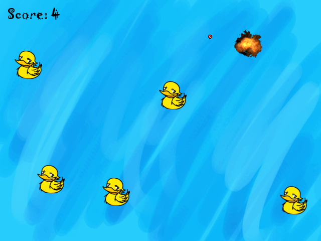
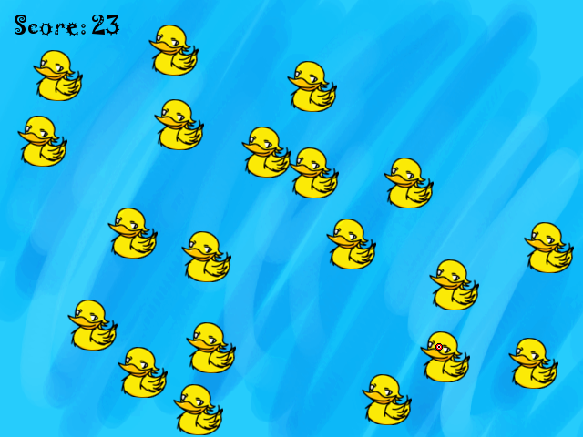

``
DISCLAIMER:
	This is a very old project I've worked on. I was still learning how to program. So the code it is not great or clean. I'll refactor this code to make it more readable in the future.
``

# Hit the Duck for Nintendo Wii

A homebrew target shooter game for Nintendo Wii where you shoot ducks in three different stages! It uses the Wiimote IR to create a cursor on the screen that you use to aim and shoot at the ducks. In the end it will display how many ducks you have hit.

# Play the game 

To actually play the game, you need to have a modded Nintendo Wii with Homebrew Channel installed on it. If you search on the internet you'll find a plenty of tutorial that will teach you how to do that.

You can also play it on a emulator for Nintendo Wii, like Dolphin. But since the game uses the Wiimote IR to position the cursor to shoot on screen, you'll need to have a IR bar and a Wiimote or try to emulate both using the emulator.

The game is in the ``dist`` folder. Put the files in a SD card, insert in your Nintendo Wii, launch the Homebrew channel and play the game. If you are using an emulator, you need to put the ``dist/data`` folder inside the virtual sd card of the emulator, so the game can find the images that it is using.

# Contribute

If you want to edit the source code and compile, just download the DevkitPro PPC package, that will include all the necessary binaries and also a little IDE (Programmer's notepad) that will make the compilation proccess a little easier. After downloading and installing everything, just open up the project that is inside the ``source`` folder and you are good to go.

# Dependencies

To acctually compile the code you need to have some libraries installed in your DevkitPro PPC package. I don't remember them right now, so I'll be back here some day to update this README with the dependencies.

# License

MIT License
